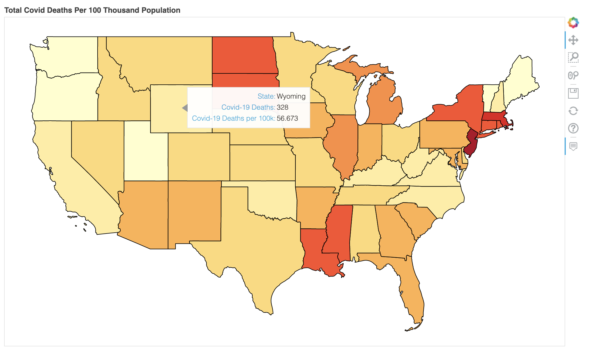
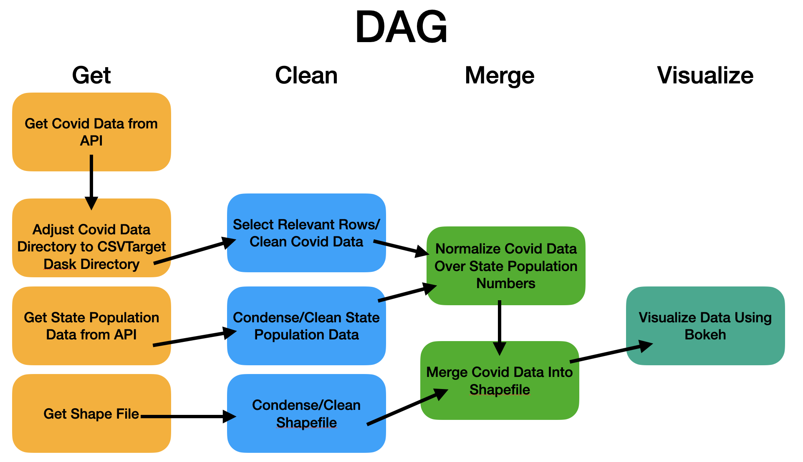

[](https://travis-ci.com/skyros/2020fa-final-project-skyros)
[](https://codeclimate.com/repos/5fc79c63d7c28d43c7000ccb/maintainability)
[](https://codeclimate.com/repos/5fc79c63d7c28d43c7000ccb/test_coverage)

# Final Project

Geospatial Data Visualization of Covid-19 Data Using GeoPandas, Luigi, Dask, and Bokeh

## Installation

After downloading the project, use [pipenv](https://pypi.org/project/pipenv/) to install the project dependencies.

```bash
pipenv install
```

## Usage

```bash
pipenv run python -m final_project [-h] [-i] [-o]
```

## Project Requirements

### Packages

- CSCI-Utils
- Dask[dataframe]
- GeoPandas[GeoDataFrame]
- Luigi
- FastParquet
- Bokeh
- Requests
- Boto3

### Dev-Packages

- Pytest
- Pytest-cov
- Shapely

## Project Description

### Summary

For my CSCI E-29 Final Project, I chose to build a Luigi Pipeline to visualize Covid-19 geographically. The pipeline uses API calls to The Covid Tracking Project and The US Census Bureau as data sources and as such uses up to date datasets. The data is then condensed, cleaned, merged, and eventually visualized with Bokeh to produce an interactive HTML file similar to what is seen below.

<foreignobject>



#### *A Note About The Shapefile Data:*

As there is no API for shapefiles at the US Census Bureau, the files had to be downloaded manually and uploaded to S3. While my project was designed to initialize the shapefile pipeline at S3, I have provided the files (and subsequently designed an intermediary task to hit them in the pipeline) so that my project can be run without needing my S3 credentials.

### Project Goals

My overall goals when starting this project were as follows:

- Create a working geographical data visualization Luigi pipeline.
- Use Python as glue to tie together multiple technologies.
- Use Dask to do lazy data processing as much as possible.
- Dig into Bokeh and practice with some of the visualization techniques and technologies introduced late in CSCI E-29.
- Find good opportunities to incorporate techniques and technologies learned in CSCI E-29 and solidify my understanding of them.

## Navigating This Project

The link to my presentation on this project can be found [here](https://youtu.be/3eRj5aOY21k). It gives a general overview of the project structure and features.

### The Luigi Tasks follow this DAG:



### Luigi Pipeline Tasks/Files

Below is an overview of the Tasks in my Luigi pipleline with the files they are contained within. I included a brief summary of what each task does.

#### Get Data Tasks - [getdata.py](final_project/getdata/getdata.py)

- `DailyCovidData` - Get Covid-19 Data from API, Saves to csv.
- `DaskFSDailyCovidData` - Sets Up the Covid-19 csv file to be Picked up as a Dask CSVTarget.
- `StatePopulation` - Gets State Population Data From API.
- `ShapeFiles` - Get Shapefiles from S3.
- `LocalShapeFiles` - Saves Shapefiles Locally.

#### Clean/Merge Data Tasks - [processdata.py](final_project/processdata/processdata.py)

- Cleaning Tasks
    - `CondensedShapefile` - Cleans Shapefile.
    - `CleanedStatePop` - Cleans Population Data.
    - `CleanedCovidData` - Cleans Covid Data.
- Merging Tasks
    - `PopulationStats` - Merges Population Data with Covid Data.
    - `MergedData` - Merges Population/Covid Data with Shapefile.

#### Visualize Data Tasks - [visualizedata.py](final_project/visualizedata/visualizedata.py)

- `VisualizedData` - Visualizes Data.

### Utils/Testing Files

I dive a little more in depth with these files below but I will provide them here. Utils has Luigi targets I wrote for Shapefile Targets as well as the Salter class.

- [utils.py](final_project/utils/utils.py)

I also wrote some fairly extensive tests here.

- [test_pset.py](test_pset.py)

## Advanced Python Highlights

### Expanding Luigi Composition

The construction of the Luigi tasks uses the pset_ 5 composed versions of `requires`, `requirement`, and `output`. However, it extends the functionality of these classes by adding additional `target` classes allowing for read and/or write functionality of GeoPandas' `GeoDataFrame` and Bokeh's `figure`. The implementation of these can be found in [utils.py](final_project/utils/utils.py).

#### Some things to note here:

I needed a way to handle Shapefile Targets both as LocalTagets or S3Targets. The read and write methods, however, remain the same between these two classes. I somewhat followed the method from pset_5 with `CSV_Target` and `ParquetTarget`, which inherit from a base class. However, `LocalShapeFileTarget` and `S3ShapeFileTarget` have their read and write methods established in the base class, then use `LocalTarget` and `S3Target` as a mixin using the new write methods from the base class to extend the respective Luigi targets.

### Testing

The [test file](test_pset.py) for this project is rather extensive and accomplishes some pretty cool things with regards to testing with API calls and testing Luigi Tasks. The setup was rather tedious for some of the tests, which contributed to a little bit of verbosity in places. However, I think the project demonstrates a good overall method for testing Luigi tasks.

#### Testing Luigi

My general philosophy for testing Luigi Tasks has become to focus entirely on the `run()` method as this is where most of the logic of the Task is. The `requirement` and `output` portions tend to be fairly boilerplate and usually get tested implicitly. As such, the general process for each task is as follows:

1. Generate test input and expected output.
2. Save the test input in a temporary folder.
3. Create a Luigi `ExternalTask` with the saved folder as the output target in the format the task we are testing expects.
4. Create a Test Luigi Task that inherits from the Task we are testing but requires the `ExternalTask` we just wrote and outputs to a temporary folder.
5. Open the output file and compare it to the expected output.

In viewing my tests, you will see most of my tests follow this convention.

#### Testing API Calls

I think one of the biggest breakthroughs I had while putting this project together was finally getting a solid understanding of UnitTest `mock.patch` and the `@patch` decorator. This was used for `test_pop_data` and `test_covid_data` in the test suite. In these tests, I use `@patch` to intercept a `reuqests.get` call. With both API calls, the format was different. In one, I received a csv file, in the other I received a json array. Within each of these tests, I create a `MockedAPIResponse` class with a method or a property that mocks the behavior of the API for its respective Task, containing fake data that was written in the test. That `MockedAPIResponse` is then sent as the return value of the intercepted `requests.get` call and it's method/property can then be accessed, just as it would be from the actual API.

## Potential Expansions/Improvements

During development, I sometimes found some really cool or interesting features that could expand the project but that I didn't have time for given it's scope. For some of them, I found a basic way to implement them while others were simply left on the cutting room floor. While I feel that the project in its current state more than meets my initial goals, there were several features that I could see expanded upon either within this project, or as a project of their own.

These include:

- Expanding Dask functionality to handle GeoDataFrames and geometry fields.
- Use of Luigi/CLI Parameters to give this project more of a 'tool' feeling.
- Expanding on the `Salter` class as a quick way to generate salted outputs tied to a given metric (eg date/time).
- Finding ways to generalize/restructure the existing Luigi tasks for different data source inputs.
- Do more with the living data aspect of the project.


## Conclusion/Acknowledgements

Overall I believe that this project turned out very well for its scope. I feel like most if not all of my initial goals were met and I learned a great deal and solidified a lot of material learned in the course through its development.

I would like to thank all of the teaching staff and students who contributed to the course this semester. The global health crisis has definitely added an extra challenge to an already challenging course and I most certainly would not have had as much success without everyone's support, even if that support was simply acknowledging that yes, the course is difficult. Thank you and have a good year going forward.


## Data
- [The Covid Tracking Project at The Atlantic](https://covidtracking.com/) - Covid-19 Data
- [The United States Census Bureau](https://www.census.gov/) - US State Shapefiles/Population Data
